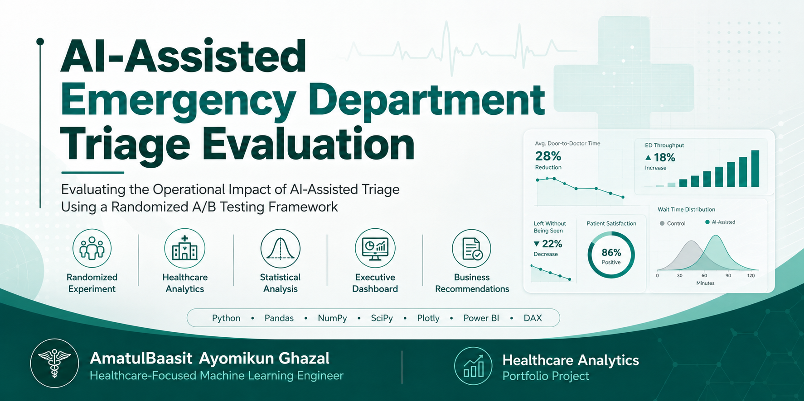
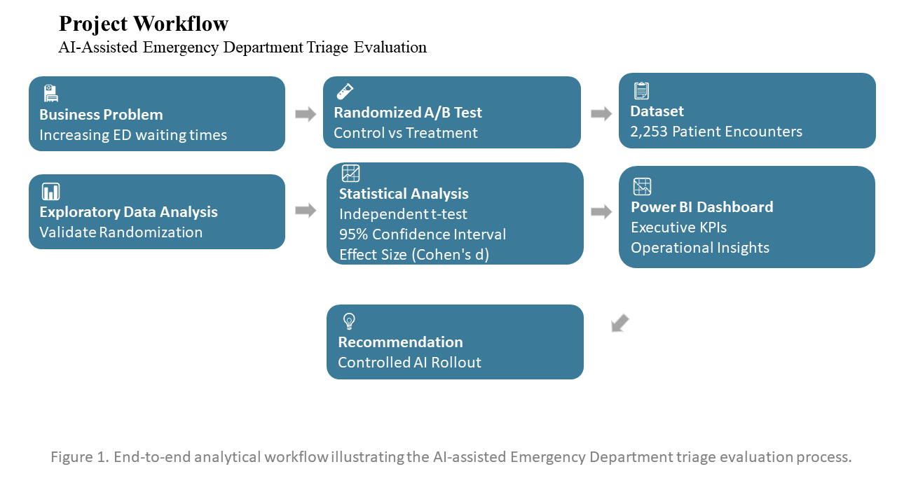
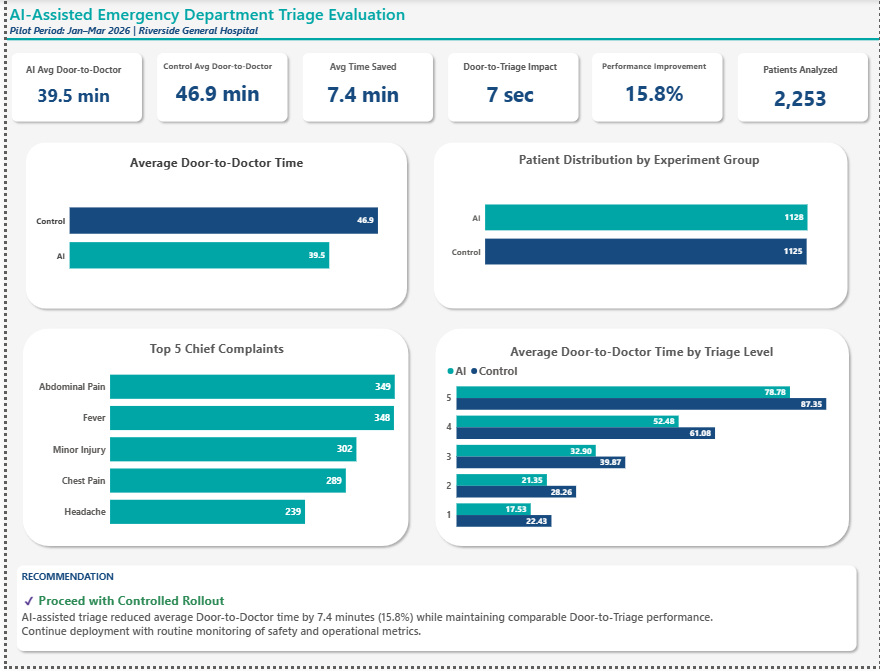

# 🏥 AI-Assisted Emergency Department Triage Evaluation


> Evaluating the operational impact of an AI-assisted triage system using a randomized A/B testing framework.

---

## Executive Summary

Emergency Departments (EDs) are often challenged by prolonged patient waiting times, overcrowding, and increasing operational pressure. One proposed solution is the introduction of AI-assisted triage systems to support clinical decision-making and improve patient flow.

This project evaluates whether implementing an AI-assisted triage process can significantly reduce patient waiting time without compromising operational performance.

Using a simulated randomized controlled A/B experiment involving **2,253 Emergency Department encounters**, this study combines statistical hypothesis testing with interactive business intelligence reporting to measure operational impact and provide evidence-based implementation recommendations.

---

## Project Highlights

| Metric | Result |
|--------|--------|
| 👥 Patient Encounters | **2,253** |
| ⏱️ Door-to-Doctor Improvement | **6–9 Minutes Faster** |
| 📊 Statistical Confidence | **95% Confidence Interval** |
| 📈 Business Intelligence | **Interactive Power BI Dashboard** |


## Table of Contents

- [Executive Summary](#executive-summary)
- [Business Problem](#business-problem)
- [Project Objectives](#project-objectives)
- [Project Workflow](#project-workflow)
- [Experimental Design](#experimental-design)
- [Dashboard Preview](#dashboard-preview)
- [Statistical Findings](#statistical-findings)
- [Business Recommendation](#business-recommendation)
- [Repository Structure](#repository-structure)
- [Technology Stack](#technology-stack)
- [Case Study](#case-study)
- [About the Author](#about-the-author)


## Business Problem

Emergency Departments frequently experience delays between patient arrival and clinical assessment.

Long waiting times can contribute to:

- Increased patient dissatisfaction
- Higher risk of patients leaving without being seen
- Greater operational strain on healthcare staff
- Reduced efficiency in emergency care delivery

Hospital leadership wanted to determine whether introducing an AI-assisted triage workflow could meaningfully improve patient throughput before considering wider deployment.

---

## Project Objectives

This project aims to:

- Evaluate the effectiveness of AI-assisted triage in reducing Door-to-Doctor time.
- Validate that patient randomization produced comparable experimental groups.
- Quantify the operational impact using statistical inference.
- Develop an executive Power BI dashboard for decision support.
- Provide business recommendations based on measurable evidence.

---

## Project Workflow



---

## Experimental Design

| Component | Description |
|-----------|-------------|
| Study Design | Randomized A/B Test |
| Population | Emergency Department patients |
| Sample Size | 2,253 patient encounters |
| Control Group | Standard triage process |
| Treatment Group | AI-assisted triage process |
| Primary Outcome | Door-to-Doctor Time |
| Statistical Test | Independent Samples t-test |
| Confidence Level | 95% |

---

## Dashboard Preview



The Power BI dashboard summarizes key operational metrics, patient distribution, statistical findings, and executive recommendations to support evidence-based decision-making.

Key dashboard components include:

- Executive KPI cards
- Patient distribution by triage level
- Average Door-to-Doctor comparison
- Average Door-to-Triage comparison
- Statistical significance summary
- Business recommendation panel

---

## Statistical Findings

The statistical analysis demonstrated a meaningful improvement in Emergency Department performance following AI-assisted triage implementation.

### Results

| Metric | Value |
|--------|------:|
| p-value | 8.828 × 10⁻¹⁴ |
| 95% Confidence Interval | (-9.13, -5.67) minutes |
| Cohen's d | -0.353 |

### Interpretation

- The observed reduction in Door-to-Doctor time is statistically significant.
- The confidence interval indicates that AI-assisted triage consistently reduced waiting time by approximately **6–9 minutes**.
- Cohen's d suggests a **small-to-moderate practical effect**, indicating operational improvement at scale.

---

## Business Recommendation

Based on the statistical evidence and operational analysis, a hospital-wide rollout is not recommended immediately.

Instead, a **controlled AI rollout** is recommended.

Recommended implementation strategy:

- Pilot deployment in selected Emergency Department units
- Continuous monitoring of operational KPIs
- Ongoing clinician oversight
- Periodic model evaluation and recalibration
- Expansion following sustained performance improvements

---

## Repository Structure

```text
ai-assisted-ed-triage-ab-testing
│
├── data
│   └── ed_triage_ab_test_dataset.csv
│
├── dashboard
│   └── AI_Assisted_ED_Triage_Dashboard.pbix
│
├── docs
│   └── AI_Assisted_ED_Triage_Case_Study.pdf
├── images
│   ├── banner.png
│   ├── workflow.png
│   └── dashboard.png
│
├── notebooks
│   └── AI_Assisted_ED_Triage_Analysis.ipynb
│
├── README.md
└── LICENSE
```

---

## Technology Stack

- Python
- Pandas
- NumPy
- SciPy
- Plotly
- Power BI
- DAX
- Jupyter Notebook / Google Colab

---

## Files Included

| File | Description |
|------|-------------|
| Notebook | Statistical analysis and hypothesis testing |
| Dashboard | Interactive Power BI dashboard |
| Dataset | Simulated Emergency Department encounters |
| Case Study | Comprehensive project report |
| Workflow | End-to-end analytical workflow |

---

## Case Study

📄 **Full Project Report**

The complete project documentation is available here:

**[AI-Assisted Emergency Department Triage Case Study](docs/AI_Assisted_ED_Triage_Case_Study.pdf)**

---

## Key Skills Demonstrated

- A/B Testing
- Experimental Design
- Statistical Hypothesis Testing
- Healthcare Analytics
- Business Intelligence
- Power BI Dashboard Development
- Data Visualization
- Data Storytelling
- Healthcare Operations Analysis
- Executive Reporting

---

## Recruiter Highlights

This project demonstrates practical experience in:

- Designing randomized A/B experiments
- Performing statistical hypothesis testing
- Translating statistical results into business recommendations
- Building executive dashboards in Power BI
- Applying analytics to healthcare operations
- Communicating technical findings to non-technical stakeholders


## About the Author

**AmatulBaasit Ayomikun Ghazal**

Healthcare-Focused Machine Learning Engineer passionate about applying machine learning, analytics, and experimentation to solve real-world healthcare challenges through data-driven decision-making.

---

## Connect With Me

- LinkedIn: *(www.linkedin.com/in/amatulbaasitghazal)*
- GitHub: *(https://github.com/AmatulBaasitAyomikun)*

---

⭐ If you found this project interesting, consider giving the repository a star.
